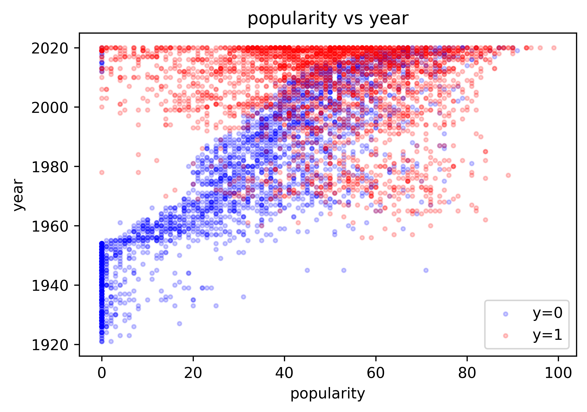
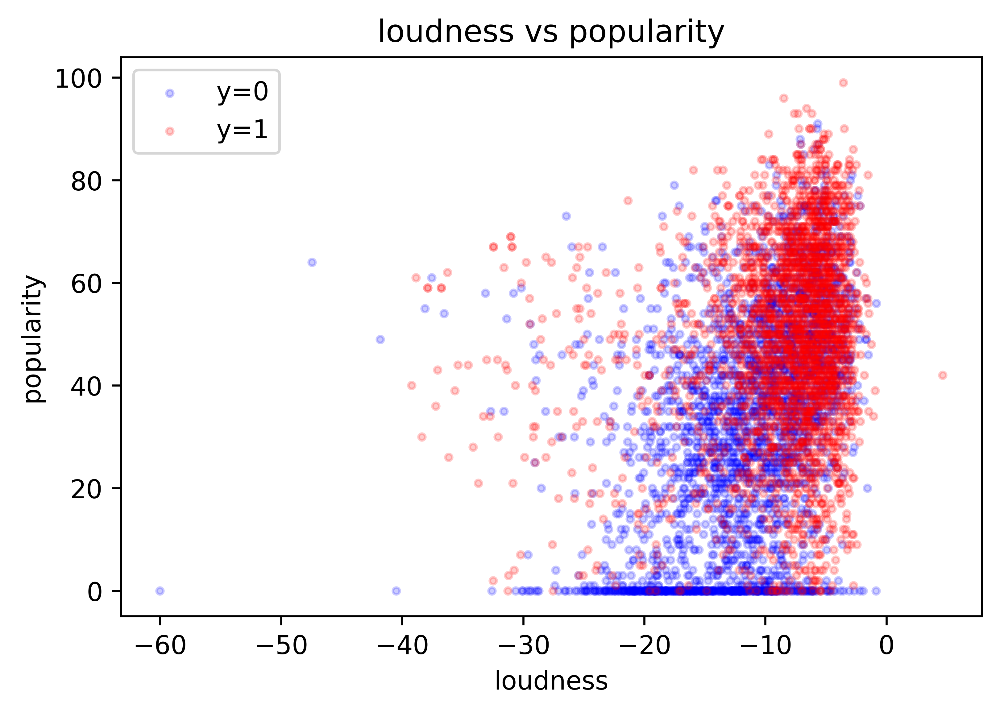
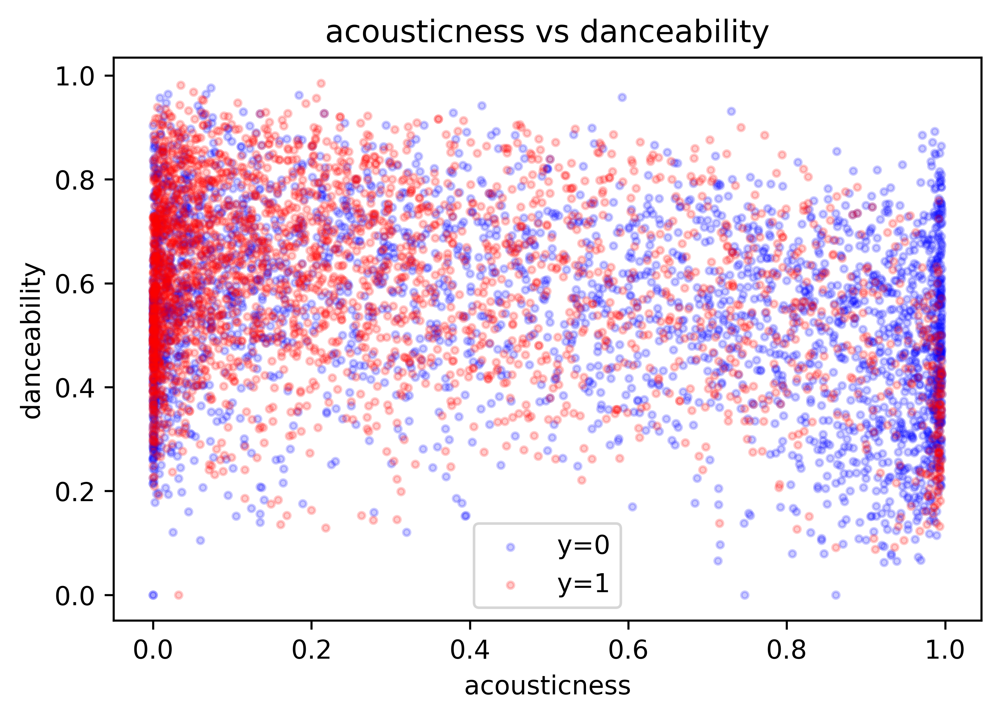
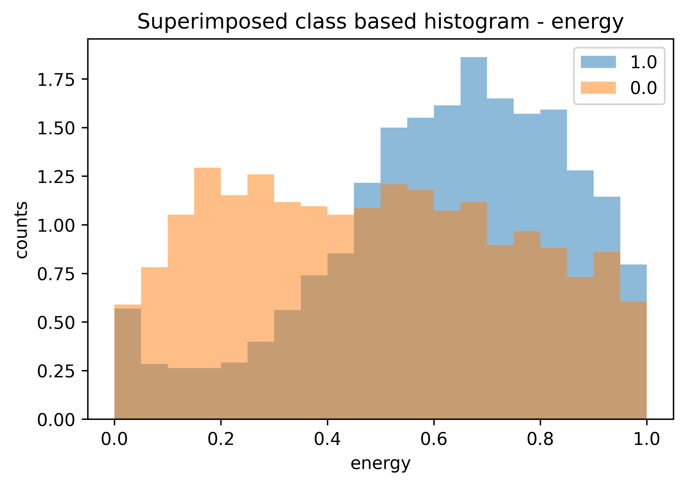
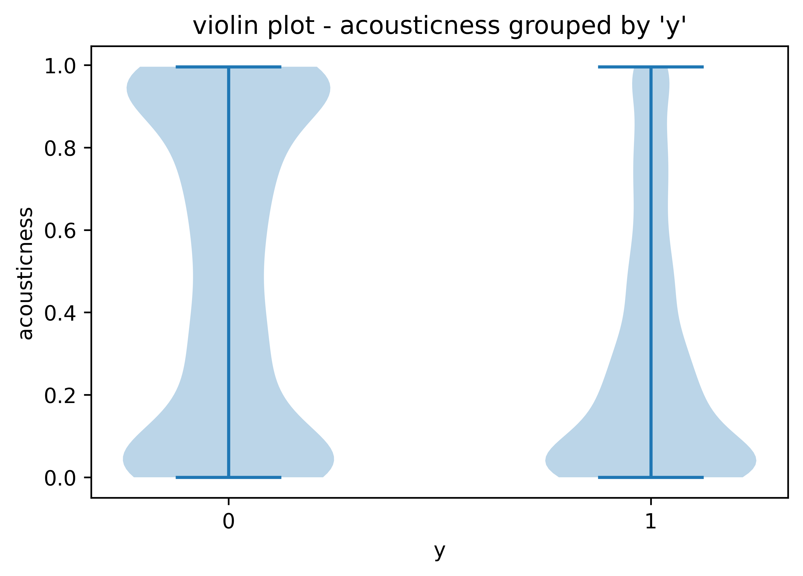
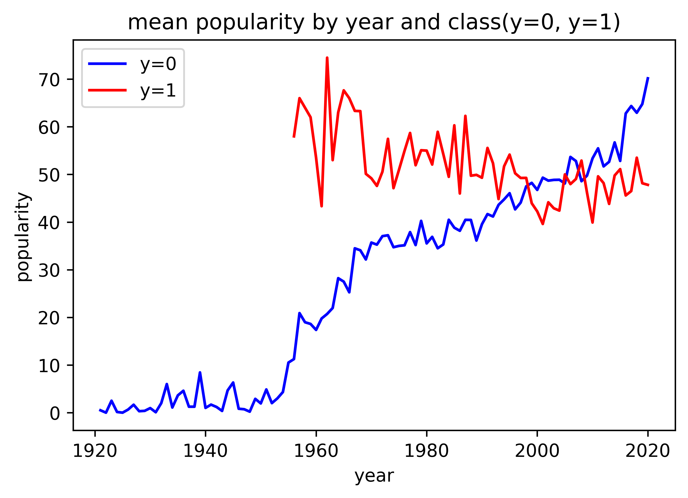
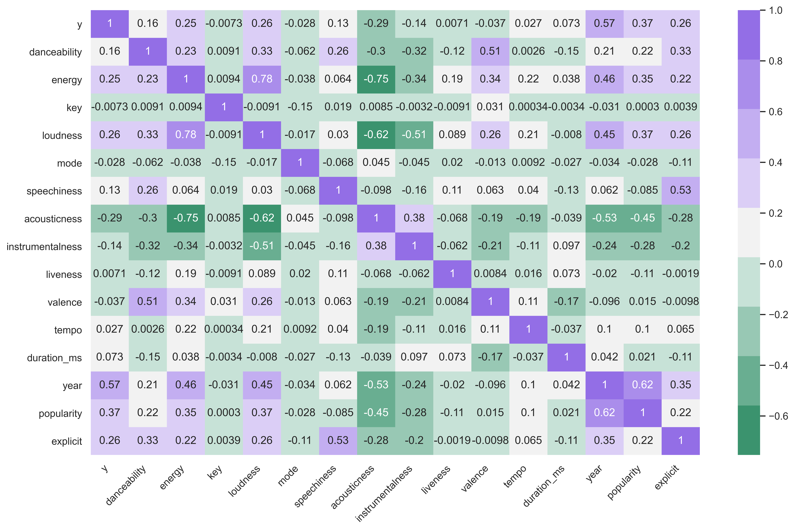

# Spotify Personal Listening Song Classifier
### Project Overview
&nbsp;&nbsp;&nbsp;&nbsp;&nbsp;&nbsp; As a musician and music lover I have long felt that genre is an inadequate metric for classifying music/musical preferences.  Using a one dimensional measurement such as genre can be a useful approximation but it lacks descriptive depth and leaves many nuances of a piece of music unaddressed.  Classifying both John Coltrane and Frank Sinatra as Jazz artists or James Brown's 'Cold Sweat' and Earth Wind and Fire's 'Serpentine Fire' as both Funk songs seems to be reductive to the point where it almost loses all meaning.  Additionally many people, myself included, listen to music that spans a wide variety of genres and styles which further makes attempts to classify an individual's musical preferences based solely on genre insufficient and potentially counterproductive.  
&nbsp;&nbsp;&nbsp;&nbsp;&nbsp;&nbsp; With these issues in mind we ask the question "Is it possible to put aside genre and classify a user's musical preferences using underlying sonic characteristics of a song?"  Being able to classify a song as one which will potentially fit a listener's tastes could be very valuable for developing a recommendation algorithm or fine tuning an existing one.  For this project I have combined my personal Spotify listening data for the previous year with a random sample from the 160K+ track Spotify data set which is available on Kaggle.  Each row of the dataset represents a song and the features have all been pulled from Spotify's API.  The goal of the project is to develop a binary classification algorithm - class 0: song from random sample from Kaggle dataset, class 1: song from my personal history.  The final model classifies songs with recall of ~ .9(and accuracy of ~ .84).  It is worth noting that just because a song wasn't in my personal history for the past year doesn't mean I wouldn't like it or haven't listened to it at some point more than a year ago.  For these reasons there is likely lots of overlap between the audio features from a random sample from the Kaggle dataset and my personal Spotify history.  Therefore an expectation of anything approaching a perfect classifier would be unreasonable.  We feel that the model's performance is very strong.  
&nbsp;&nbsp;&nbsp;&nbsp;&nbsp;&nbsp; After building the model we create a playlist with all the songs that are from the Kaggle dataset that are incorrectly labeled as songs from my personal listening history.  If the songs are from the random sample but the model thinks that the song characteristics are in line with my personal listening data(type 1 error) then I might like the song! And in fact this playlist has helped me discover many new artists that I had never heard of and several songs that I love but haven't heard or thought about in years.

### Language, Packages and Resources Used
**Language:**  Python 3.8.3  
**Packages:** datetime, sklearn, xgboost, numpy, matplotlib, seaborn, requests, pandas and json  
**Resources:** _get_spotify_uri method and type_1_playlist class partially adapted from https://github.com/TheComeUpCode/SpotifyGeneratePlaylist/blob/master/create_playlist.py  

### Descriptions of Audio Features Pulled from Spotify API
These feature descriptions are from [Spotify's documentation](https://developer.spotify.com/documentation/web-api/reference/tracks/get-audio-features/)  
* duration_ms - int - The duration of the track in milliseconds.  
* key	- int	- The estimated overall key of the track. Integers map to pitches using standard Pitch Class notation . E.g. 0 = C, 1 = C♯/D♭, 2 = D, and so on. If no key was detected, the value is -1.  
* mode - int - Mode indicates the modality (major or minor) of a track, the type of scale from which its melodic content is derived. Major is represented by 1 and minor is 0.  
* time_signature - int	- An estimated overall time signature of a track. The time signature (meter) is a notational convention to specify how many beats are in each bar (or measure).  
* acousticness	- float	- A confidence measure from 0.0 to 1.0 of whether the track is acoustic. 1.0 represents high confidence the track is acoustic.  
* danceability	- float	- Danceability describes how suitable a track is for dancing based on a combination of musical elements including tempo, rhythm stability, beat strength, and overall regularity. A value of 0.0 is least danceable and 1.0 is most danceable.  
* energy	- float	- Energy is a measure from 0.0 to 1.0 and represents a perceptual measure of intensity and activity. Typically, energetic tracks feel fast, loud, and noisy. For example, death metal has high energy, while a Bach prelude scores low on the scale. Perceptual features contributing to this attribute include dynamic range, perceived loudness, timbre, onset rate, and general entropy.  
* instrumentalness	- float	- Predicts whether a track contains no vocals. “Ooh” and “aah” sounds are treated as instrumental in this context. Rap or spoken word tracks are clearly “vocal”. The closer the instrumentalness value is to 1.0, the greater likelihood the track contains no vocal content. Values above 0.5 are intended to represent instrumental tracks, but confidence is higher as the value approaches 1.0.  
* liveness	- float	- Detects the presence of an audience in the recording. Higher liveness values represent an increased probability that the track was performed live. A value above 0.8 provides strong likelihood that the track is live.  
* loudness	- float	- The overall loudness of a track in decibels (dB). Loudness values are averaged across the entire track and are useful for comparing relative loudness of tracks. Loudness is the quality of a sound that is the primary psychological correlate of physical strength (amplitude). Values typical range between -60 and 0 db.  
* speechiness	- float	- Speechiness detects the presence of spoken words in a track. The more exclusively speech-like the recording (e.g. talk show, audio book, poetry), the closer to 1.0 the attribute value. Values above 0.66 describe tracks that are probably made entirely of spoken words. Values between 0.33 and 0.66 describe tracks that may contain both music and speech, either in sections or layered, including such cases as rap music. Values below 0.33 most likely represent music and other non-speech-like tracks.  
* valence	- float	- A measure from 0.0 to 1.0 describing the musical positiveness conveyed by a track. Tracks with high valence sound more positive (e.g. happy, cheerful, euphoric), while tracks with low valence sound more negative (e.g. sad, depressed, angry).  
* tempo	- float	- The overall estimated tempo of a track in beats per minute (BPM). In musical terminology, tempo is the speed or pace of a given piece and derives directly from the average beat duration.  

### get_data Notebook  
With the Create_DF class a user can create two different data sets.  The add_audio_features method takes in a user's personal listening json files and creates a dataframe with audio features from the Spotify API and target variable with value 0 for songs listened to once and 1 for songs listened to more than once.  The merge_personal_kaggle method merges the df created using add_audio_features with a random sample from the Kaggle Spotify data set.  The target variable 'y' is changed to 0 for songs from the random sample and 1 for song from personal listening history.  This code could easily be adapted to create a dataset with a different user's personal listening data.  Request your personal listening data from Spotify and download the Kaggle Spotify dataset.  Client_id, client_secret, spotify_token, spotify_user_id can all be obtained from Spotify's website.  Comments have been provided in the notebook to assist in making the necessary changes.  For this project we use the dataset created by the merge_personal_kaggle method.  

### eda_notebook Notebook  
In this notebook we perform exploratory data analysis on the dataset.  There are many interesting and useful findings highlighted in the notebook.  Some of the more interesting plots are shown below.  

### model_building Notebook  
In this notebook we train several models to classify songs from my personal listening history vs songs from a random sample from the Kaggle Spotify dataset.  This model could be used as part of a recommendation algorithm to select songs that a user might be interested in.  In order to know which metric to use we would need to know how often our application was making recommendations.  If recommendation opportunities occurred frequently, for example in order to create many playlists for a user, then recall is likely the best metric.  This metric will allow us to catch the highest possible number of condition positive songs, but this comes at the risk of misclassifying some class negative data points.  Accuracy could also be used if we want to be more careful about the overall rate of correctly classified songs.  As such we train models which optimize both metrics and a user could choose the best model based on the specific application.  We train Logistic Regression, Random Forest, SVC, a Quadratic Discriminant Analysis model, XGBoost and KNeighbors.  As can be seen below, regardless of whether we choose to use accuracy or recall XGBoost performs best, however the hyperparameter choice will be different depending on the metric.  Also the confusion matrices and feature importance measurements can be seen in the notebook.  

### create_playlist Notebook
In this notebook we create a playlist using the Spotify API of all the songs that are misclassified as being from my personal listening history when they are actually from the random sample from kaggle(type 1 error).  This code could easily be adapted to create a playlist for another users listening history.  Notes and docstrings have been provided in the notebook to assist with adaptation.  

### Model Performance
* XGBoost - test recall score:  0.8952042628774423, test accuracy score:  0.8383658969804618
* Logistic Regression- test recall score : 0.8632326820603907, test accuracy score : 0.7806394316163411  
* Random Forest-  test recall score : 0.8792184724689165, test accuracy score : 0.8321492007104796 
* QDA - test recall:  0.8792184724689165, test accuracy:  0.7566607460035524
* SVC - test recall score : 0.8152753108348135, test accuracy score : 0.7921847246891652  
* KNeighbors - test recall score : 0.8472468916518651, test accuracy score : 0.7912966252220248
